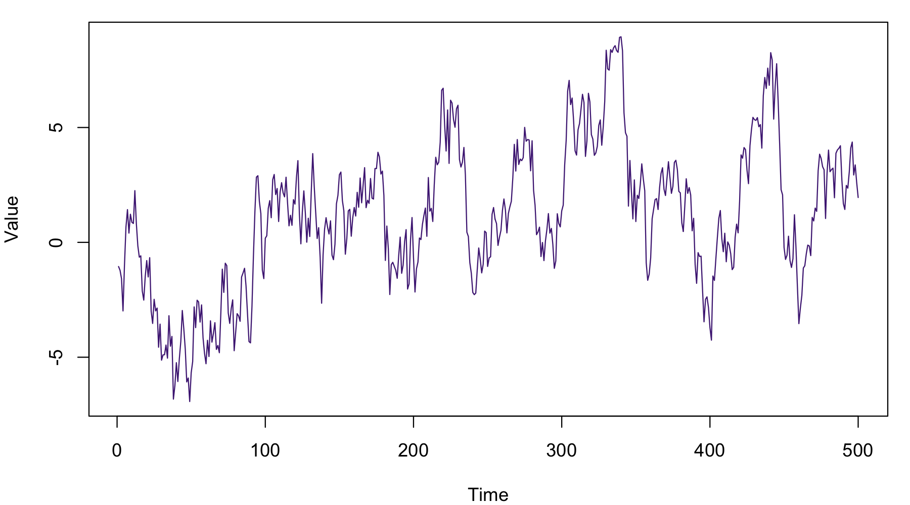

# Time Series: Long Memory {#sec-long-memory submitted="@mrx05"}

Here is a picture of a long-memory time series (@fig-ts).

{#fig-ts width=80%}

@tbl-random is a table.

| $n$ | $\alpha$ | $n\alpha$ | $\beta$ |
|:---:|:---------|---------:|:-------:|
| 1   | 0.2      | 0.2      | 5       |
| 2   | 0.3      | 0.6      | 4       |
| 3   | 0.7      | 2.1      | 3       |

: A random table. {#tbl-random}

A numbered equation:

$$
y = mx + b
$$ {#eq-line}

As shown in @eq-line and discussed by @mrx05 and @Nobody06.

## A Section

Some text to show the running header.
